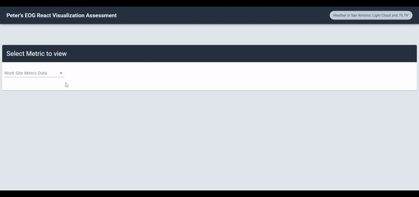
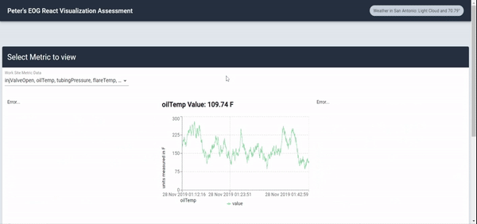

## Create React App Visualization

This assessment was bespoke handcrafted for me.

Read more about this assessment [here](https://react.eogresources.com)

Data visualization assessment for EOG in react.
Using apollo for calling GraphQL data querys and uses the apollo react hook `useQuery()`,
recharts for all data charting
NOTE: all time stored in the app is in UTC.
here's a test of the app:

and it has toast for notifications like errors and loading status:

